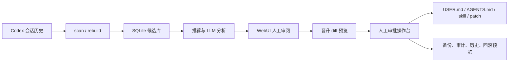
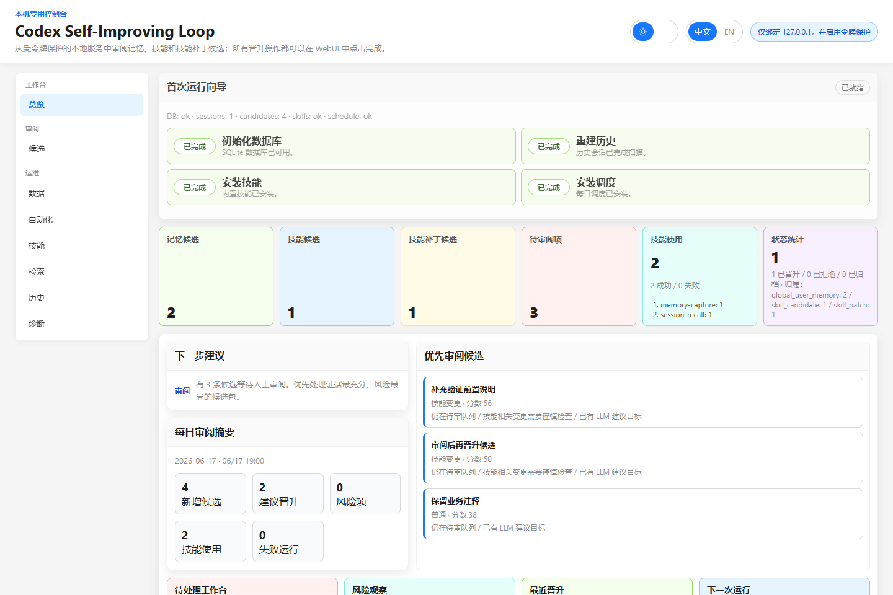
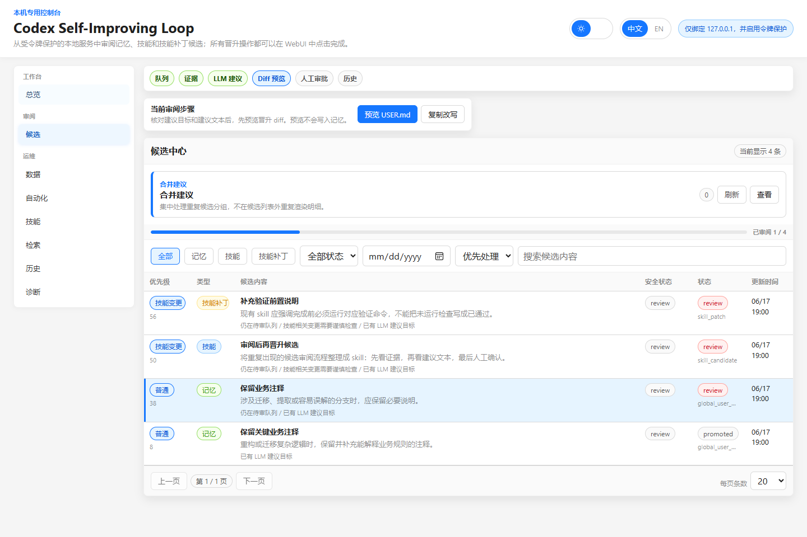
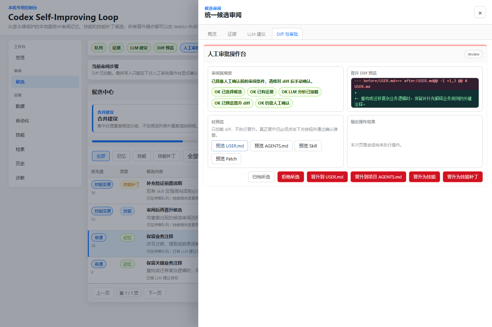
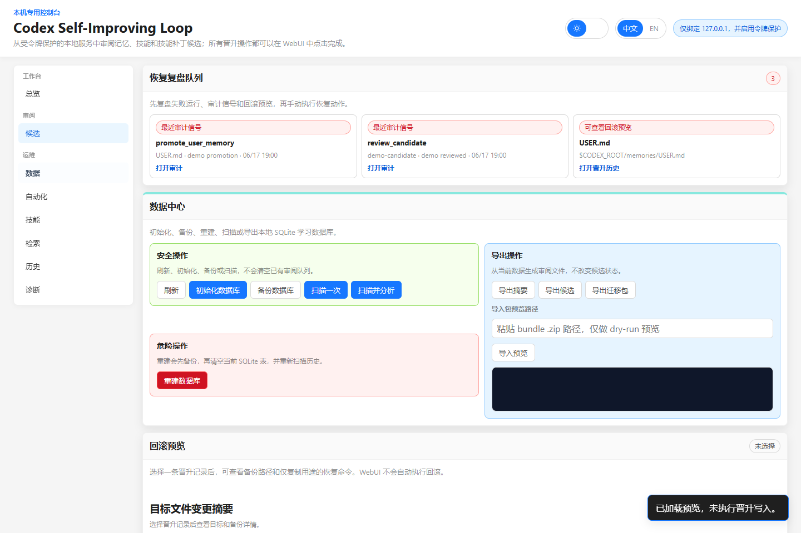
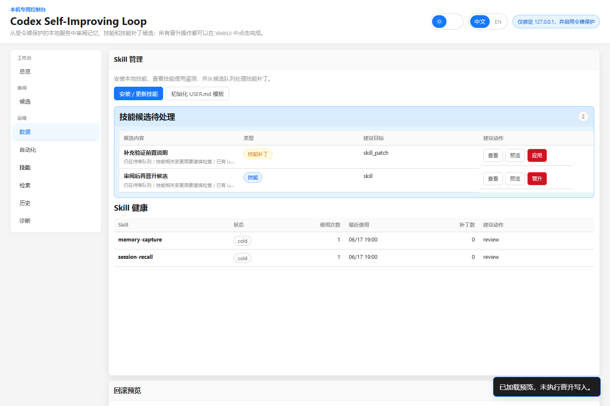

# Codex Self-Improving Loop

Codex Self-Improving Loop 是一个只面向本机运行的 Codex 自改进控制台。它把 Codex 会话历史、可复用经验、候选记忆、候选 skill、skill patch、审阅记录和晋升历史统一写入本地 SQLite，并通过 WebUI 完成人工审阅和人工晋升。

## 目录

- [项目说明](#项目说明)
- [核心概念](#核心概念)
- [快速上手](#快速上手)
- [日常流程](#日常流程)
- [WebUI 截图与使用教程](#webui-截图与使用教程)
- [功能说明](#功能说明)
- [CLI 命令](#cli-命令)
- [数据目录与安全边界](#数据目录与安全边界)
- [本地 API](#本地-api)
- [验证](#验证)

## 项目说明

这个项目解决的是 Codex 长期使用中的三个问题：

- 会话经验容易散在历史记录里，下次很难被准确召回。
- 有些偏好、项目事实或工作流值得沉淀，但不能自动写入长期记忆。
- skill 和 skill patch 需要证据、diff、审计和回滚视角，而不是靠一次性复制粘贴。

因此本项目提供一条本机闭环：



项目只管理本机运行时数据，不依赖私有仓库路径，也不要求后台服务常驻。每日扫描可以通过系统调度器定时运行；审阅、晋升和恢复操作都在 WebUI 中人工触发。

## 核心概念

| 概念               | 说明                                                                                   |
| ------------------ | -------------------------------------------------------------------------------------- |
| Session            | Codex 历史会话文件。扫描器从这里提取候选和 skill 使用信号。                            |
| Candidate          | 待审阅候选，类型包括 `memory`、`skill`、`skill_patch`。                                |
| Recommendation     | 对候选的审阅建议，例如晋升、合并、归档或继续人工审阅。                                 |
| LLM Analysis       | Codex 可生成的候选分析包，包含证据评估、风险、范围、改写质量和下一步建议。             |
| Evolution Proposal | 建议写入目标和建议文本，例如 `USER.md`、`AGENTS.md`、skill 或 patch。                  |
| Promotion Preview  | 写入前的 diff 预览。预览不改文件。                                                     |
| Manual Approval    | 最终写入入口。所有晋升都必须由用户在 WebUI 中确认。                                    |
| Digest             | 每次扫描或重建后的 SQLite 摘要，记录新增候选、建议晋升、风险项、skill 使用和失败运行。 |
| Audit / History    | 审阅、晋升、合并、导出等动作的审计和历史视图。                                         |

## 快速上手

### 1. 准备环境

需要 Python 3.10 或更高版本。项目运行时脚本只依赖 Python 标准库；浏览器截图测试需要额外的本机浏览器依赖，但日常使用 WebUI 不需要安装前端构建工具。

### 2. 安装

```bash
git clone https://github.com/newcatshuang/codex-self-improving-loop.git
cd codex-self-improving-loop
python install.py
```

安装器会复制：

- `sil.py` 和 `src/codex_sil` 到 `$HOME/.agents/codex-self-improving-loop`。
- `session-recall` 和 `memory-capture` skills 到 `$HOME/.agents/skills`。
- `codex/memories/USER.template.md` 到 `$HOME/.codex/memories/USER.md`，仅在目标不存在时创建。

安装后的 `$HOME/.agents/codex-self-improving-loop` 是运行副本。调度器、桌面快捷方式和 skills 都指向它，所以即使 Git checkout 被移动或删除，本机循环仍可继续工作。

### 3. 检查运行环境

```bash
python "$HOME/.agents/codex-self-improving-loop/sil.py" doctor
```

如果想使用自定义 Codex 根目录，可以给所有命令加上：

```bash
--codex-root /path/to/codex-root
```

### 4. 初始化或重建历史

```bash
python "$HOME/.agents/codex-self-improving-loop/sil.py" init
python "$HOME/.agents/codex-self-improving-loop/sil.py" rebuild --backup
```

`init` 只创建 SQLite 和 WebUI 运行资产。`rebuild --backup` 会先备份现有数据库，再从历史 session 全量重扫。

### 5. 打开 WebUI

```bash
python "$HOME/.agents/codex-self-improving-loop/sil.py" serve --open
```

后端只监听 `127.0.0.1`，启动时会在 URL 中带上本轮 token。关闭终端进程后，本轮 WebUI 后端随之停止；每日扫描不依赖这个后端常驻。

## 日常流程

### 推荐工作流

1. 扫描新增会话：

   ```bash
   python "$HOME/.agents/codex-self-improving-loop/sil.py" scan --once
   ```

2. 打开 WebUI：

   ```bash
   python "$HOME/.agents/codex-self-improving-loop/sil.py" serve --open
   ```

3. 在总览页查看下一步建议、待审阅候选、digest 和失败运行。
4. 在候选审阅页查看候选证据、LLM 分析、建议文本和合并建议。
5. 先预览晋升 diff，再在人工审批操作台确认是否写入。
6. 在运维与历史区域查看备份、导出、审计、晋升历史和回滚预览。

### 每日自动扫描

```bash
python "$HOME/.agents/codex-self-improving-loop/sil.py" schedule install
```

调度器默认每天 `03:00` 执行一次：

```text
sil.py scan --once
```

跨平台行为：

| 系统    | 行为                                                                      |
| ------- | ------------------------------------------------------------------------- |
| Windows | 创建或替换 `CodexSelfImprovingLoop` Task Scheduler 任务。                 |
| macOS   | 写入并加载 `~/Library/LaunchAgents/com.codex.self-improving-loop.plist`。 |
| Linux   | 写入并启用 `systemd --user` timer。                                       |

如果只是想准备一键启动 WebUI：

```bash
python "$HOME/.agents/codex-self-improving-loop/sil.py" shortcut install
```

## WebUI 截图与使用教程

下面截图使用合成演示数据生成，只包含通用候选、占位路径和示例操作，不包含真实本机路径、真实会话内容、私有仓库名、密钥或个人信息。

### 1. 总览：先看下一步该做什么



总览页用于每天第一次打开时快速判断状态：

- 首次运行向导显示数据库、历史重建、skills 和调度器是否就绪。
- 统计卡片展示 memory、skill、skill patch、待审阅项、skill 使用和状态分布。
- 下一步建议会根据待审阅候选、失败运行和扫描状态提示当前优先动作。
- 每日审阅摘要显示新增候选、建议晋升、风险项、skill 使用和失败运行。
- 优先审阅候选会把风险、skill 变更和高置信度候选排到前面。

使用方式：

1. 如果向导未就绪，先进入数据中心执行初始化或重建。
2. 如果存在失败运行，先查看运维与历史里的运行日志和审计信号。
3. 如果有待审阅候选，进入候选审阅页，从优先级最高的候选开始。

### 2. 候选审阅：证据、建议和合并入口集中处理



候选审阅页是主要工作台：

- 顶部阶段条显示当前审阅阶段：队列、证据、LLM 建议、diff 预览、人工审批、历史。
- 候选中心支持按类型、状态、日期、优先级和关键词筛选。
- 合并建议用于处理相似候选，避免重复晋升。
- 候选行展示类型、目的地、安全状态、审阅状态、优先级和更新时间。
- 选择候选后，会打开统一审阅抽屉查看详情。

使用方式：

1. 先选择一个候选。
2. 查看证据来源和候选文本是否足够稳定。
3. 查看 LLM 分析中的风险、范围、冲突和建议目标。
4. 对相似候选先处理合并建议，再决定是否晋升。

### 3. 人工审批：先预览 diff，再确认写入



人工审批操作台是唯一会触发晋升写入的位置：

- `预览 USER.md`、`预览 AGENTS.md`、`预览 Skill`、`预览 Patch` 只加载 diff，不写文件。
- 写入按钮会使用高风险样式，并弹出结构化确认对话框。
- 确认前必须满足候选已选择、证据已查看、LLM 分析已加载、diff 已预览等条件。
- 晋升会写入目标文件，并记录 promotions、audit log 和可用于手动恢复的备份信息。

使用方式：

1. 根据候选范围选择正确目标：全局偏好进 `USER.md`，项目事实进 `AGENTS.md`，可复用流程进 skill，已有 skill 的改进进 patch。
2. 点击对应预览按钮，检查 diff 是否只包含预期文本。
3. 确认没有隐私、密钥、过期事实或项目外泄信息后，再点击晋升按钮。
4. 晋升后到历史审计页查看记录；需要恢复时只使用回滚预览给出的手动命令。

### 4. 运维：数据、备份、导出和恢复入口



运维区把高风险动作和安全动作分开：

- 安全操作：刷新、初始化数据库、备份数据库、扫描一次、扫描并分析。
- 危险操作：重建数据库。重建前会先备份，再清空当前 SQLite 表并重扫历史。
- 导出操作：导出 digest、候选列表或迁移包，不改变候选状态。
- 导入预览：只做 dry-run 预览，不直接覆盖运行数据。
- 恢复复盘队列：把失败运行、审计信号和可回滚记录集中展示。

使用方式：

1. 日常只需要 `扫描一次` 或 `扫描并分析`。
2. 大范围历史变更后使用 `重建数据库`，并保留自动生成的备份。
3. 迁移或备份前先导出 bundle。
4. 回滚只看预览和命令，WebUI 不会自动执行覆盖恢复。

### 5. Skill 管理：同步内置 skills，处理 skill 候选和补丁



Skill 管理页关注两件事：

- 安装或更新内置 `session-recall`、`memory-capture` skills。
- 查看 skill 相关候选、skill 使用次数、最近使用时间、补丁数和建议动作。

使用方式：

1. 安装后或升级后点击 `安装 / 更新技能`，同步仓库内置 skills 到 `$HOME/.agents/skills`。
2. 如果 `USER.md` 不存在，可点击 `初始化 USER.md 模板`。
3. 对 skill 候选先点击查看或预览，确认触发条件、步骤、验证和安全边界，再晋升。
4. 对 skill patch 候选先导出 patch，再人工检查目标 skill，避免自动改变代理行为。

## 功能说明

| 功能         | 说明                                                                     |
| ------------ | ------------------------------------------------------------------------ |
| 会话扫描     | 从 Codex session 历史中提取候选、skill 使用和运行记录。                  |
| 历史重建     | 备份后重置 SQLite 数据，再从历史会话全量重扫。                           |
| 候选去重     | 使用 normalized 文本避免完全重复候选；相似候选通过合并建议处理。         |
| 候选类型     | 支持 `memory`、`skill`、`skill_patch`。                                  |
| 审阅建议     | 为每个候选生成确定性建议，Codex 可用时可扩展为更高质量分析。             |
| LLM 分析     | 生成证据评估、稳定性、范围、风险、冲突、改写质量和下一步建议。           |
| 晋升预览     | 对 `USER.md`、`AGENTS.md`、skill、patch 生成 diff，不直接写入。          |
| 人工晋升     | 只有 WebUI 人工确认后才写目标文件，并保留备份和审计记录。                |
| 跨会话检索   | `sil.py recall` 使用 SQLite FTS 搜索 session 和候选，返回脱敏片段。      |
| Daily Digest | 每次扫描或重建后保存摘要，便于每日复盘。                                 |
| 导出与迁移   | 支持 digest、候选和 bundle 导出；导入前支持 dry-run 预览。               |
| 调度器       | 跨平台安装每日 `03:00` 的本机扫描任务。                                  |
| 桌面快捷方式 | 创建本机 WebUI 一键启动入口。                                            |
| 诊断         | WebUI 和 `doctor` 命令都能查看运行目录、数据库、服务绑定和最近运行状态。 |

## CLI 命令

所有命令都可以从安装后的运行副本执行：

```bash
python "$HOME/.agents/codex-self-improving-loop/sil.py" <command>
```

| 命令                   | 用途                                                   |
| ---------------------- | ------------------------------------------------------ |
| `doctor`               | 输出版本、运行目录、数据库、WebUI 文件和服务绑定信息。 |
| `init`                 | 初始化 SQLite 数据库和运行目录。                       |
| `rebuild --backup`     | 备份现有数据库，然后全量重扫历史会话。                 |
| `scan --once`          | 扫描新增会话并退出。                                   |
| `serve --open`         | 启动本机 WebUI 后端并打开浏览器。                      |
| `serve --smoke-test`   | 不启动长期服务，只验证 WebUI 服务配置。                |
| `recall --query "..."` | 搜索历史 session 和候选。                              |
| `schedule install`     | 安装每日扫描调度。                                     |
| `schedule uninstall`   | 移除每日扫描调度。                                     |
| `shortcut install`     | 安装桌面启动入口。                                     |
| `shortcut uninstall`   | 移除桌面启动入口。                                     |

示例：

```bash
python "$HOME/.agents/codex-self-improving-loop/sil.py" recall --query "SQL columns"
python "$HOME/.agents/codex-self-improving-loop/sil.py" serve --port 8765 --open
```

## 数据目录与安全边界

运行时数据统一位于：

```text
$HOME/.codex/self-improving-loop/
├─ self-improving-loop.sqlite
├─ codex-self-improving-loop.html
├─ self-improving-loop.log
├─ backups/
├─ exports/
├─ web/
│  ├─ styles.css
│  └─ app.js
└─ tmp/
```

安全边界：

- WebUI 后端只绑定 `127.0.0.1`。
- 每次 `serve` 都生成新的 token，API 请求必须携带 token。
- 不支持公网访问，也不支持局域网共享。
- 扫描器不会自动晋升 memory、project facts、skills 或 skill patches。
- 所有写入目标文件的晋升都必须由用户在 WebUI 中确认。
- 回滚是预览和手动命令，不会由 WebUI 自动覆盖文件。
- 导入 bundle 默认先 dry-run 预览，不直接写入。
- 不要提交 SQLite 数据库、导出包、session 历史、截图中的真实个人信息或本机路径。

### 提取策略

扫描优先尝试使用 Codex CLI 做结构化提取、分析和建议：

```text
codex exec --ephemeral --skip-git-repo-check --sandbox read-only --output-schema extraction.schema.json
```

如果 Codex 不可用、执行失败、超时、JSON 非法或 schema 校验失败，会回退到内置规则提取器。测试或快速重建时可以设置：

```bash
CODEX_SIL_DISABLE_CODEX=1
```

`--ephemeral` 用于避免自动提取本身产生新的 session 文件，防止下一轮重复扫描。

## 本地 API

WebUI 使用本地 JSON API。除页面资源外，接口都需要 token。

| 接口                                                                           | 用途                           |
| ------------------------------------------------------------------------------ | ------------------------------ |
| `GET /api/health`                                                              | 健康检查。                     |
| `GET /api/setup/status`                                                        | 首次运行向导状态。             |
| `GET /api/summary`                                                             | 总览统计和候选列表。           |
| `GET /api/recommendations`                                                     | 候选审阅建议。                 |
| `POST /api/candidates/{id}/recommend`                                          | 重新生成某条候选建议。         |
| `GET /api/candidates/{id}/analysis`                                            | 获取或生成候选分析和进化建议。 |
| `GET /api/candidates/{id}/promotion-preview?target=user\|agents\|skill\|patch` | 生成晋升 diff。                |
| `POST /api/candidates/{id}/review`                                             | 保存审阅记录。                 |
| `POST /api/candidates/{id}/archive`                                            | 归档候选。                     |
| `POST /api/candidates/{id}/reject`                                             | 拒绝候选。                     |
| `POST /api/candidates/{id}/promote*`                                           | 人工确认后的晋升写入。         |
| `GET /api/merge-suggestions`                                                   | 查看合并建议。                 |
| `POST /api/merge-suggestions/refresh`                                          | 刷新合并建议。                 |
| `POST /api/merge-suggestions/{id}/apply`                                       | 应用合并建议。                 |
| `GET /api/digests/latest`                                                      | 获取最新 digest。              |
| `GET /api/skills/health`                                                       | 查看 skill 健康状态。          |
| `GET /api/recall?q=...`                                                        | WebUI 跨会话检索。             |
| `POST /api/export/bundle`                                                      | 导出迁移包。                   |
| `POST /api/import/preview`                                                     | 导入前 dry-run 预览。          |
| `GET /api/history`                                                             | 查看审阅和晋升历史。           |
| `GET /api/audit`                                                               | 查看审计日志。                 |
| `GET /api/promotions/{id}/rollback-preview`                                    | 查看回滚预览和手动恢复命令。   |

## 验证

项目交接前至少运行这些检查：

```bash
python tests/verify-install.py --codex-root ./tmp/codex --agents-root ./tmp/agents
python tests/verify-v2-core.py --work-root ./tmp/v2-core
python tests/verify-codex-runner.py --work-root ./tmp/codex-runner
python tests/verify-v2-recall.py --work-root ./tmp/v2-recall
python tests/verify-v2-install.py --codex-root ./tmp/codex-v2 --agents-root ./tmp/agents-v2
python -m compileall src sil.py install.py tests
```

更完整的检查可以按需增加：

```bash
python tests/verify-v2-session-filter.py --work-root ./tmp/v2-filter
python tests/verify-v2-promotion.py --work-root ./tmp/v2-promotion
python tests/verify-v2-scheduler.py --work-root ./tmp/v2-scheduler
python tests/verify-v3-migration.py --work-root ./tmp/v3-migration
python tests/verify-v3-intelligence.py --work-root ./tmp/v3-intelligence
python tests/verify-webui-browser.py --work-root ./tmp/webui-browser
```

`verify-webui-browser.py` 会在缺少本机浏览器依赖时跳过；需要强制浏览器级检查时使用 `--require-browser`。
